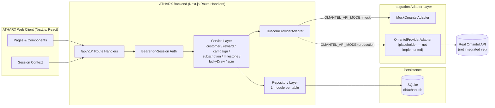
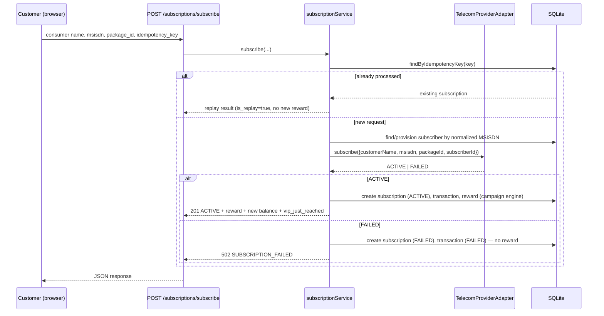
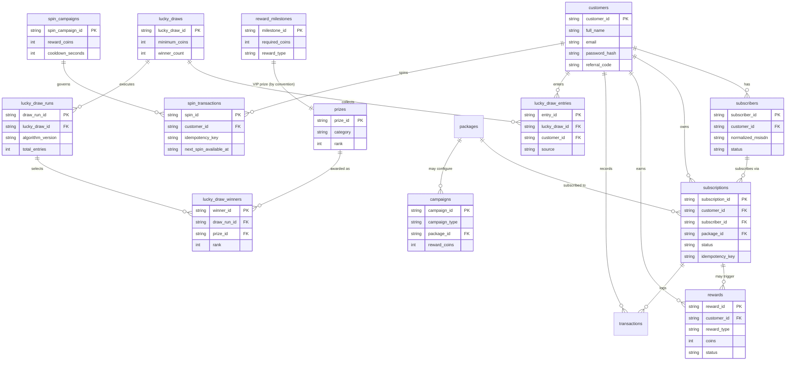
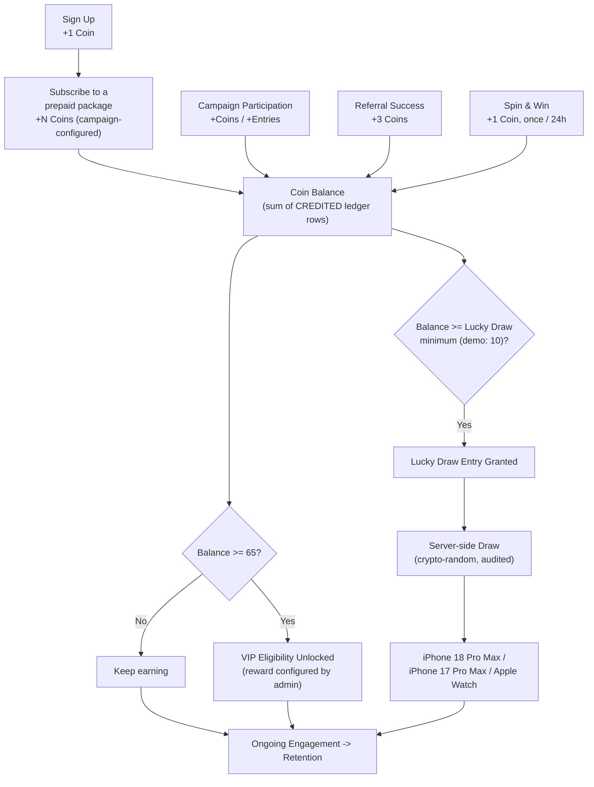
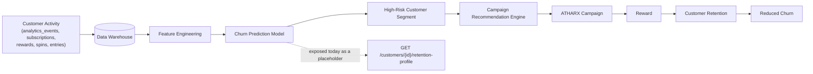

# ATHARX Architecture

## 1. System overview

The frontend never talks to the mock/real telecom system directly — it always
goes through ATHARX's own `/api/v1/*` routes, which call the service layer,
which calls the `TelecomProviderAdapter` interface. Swapping
`OMANTEL_API_MODE=mock` → `production` (once `OmantelProviderAdapter` is
implemented against real Omantel endpoints) requires no change to routes,
services, or UI.

## 2. Request flow: subscription

## 3. Database schema

Never a phone number as a primary key: MSISDNs live only as data columns
(`msisdn`, `normalized_msisdn`) on `subscribers`; every relationship uses the
generated `customer_id` / `subscriber_id` / `subscription_id` surrogate keys.
See `db/schema.sql` for the authoritative DDL, including the partial unique
index that enforces "one active subscriber per normalized MSISDN" and the
partial unique index that enforces "one signup reward per customer."

## 4. The gamification loop

Every reward-granting action funnels through the same `rewardService.creditReward`
ledger write and the same `campaignService` lookup for the reward amount — no
UI component decides how many Coins anything is worth (Rule 4).

## 5. Business rules (enforced in code, not just documented)

| # | Rule | Where it's enforced |
| --- | --- | --- |
| 1 | One signup reward per customer | Partial `UNIQUE` index on `rewards(customer_id) WHERE reward_type='SIGNUP_REWARD'`; `rewardService.creditSignupReward` also checks first |
| 2 | One subscription request creates exactly one subscription | `UNIQUE(idempotency_key)` on `subscriptions`; `subscriptionService.subscribe` returns the existing row (`is_replay: true`) on retry |
| 3 | One normalized MSISDN maps to one subscriber identity | Partial `UNIQUE` index on `subscribers(normalized_msisdn) WHERE status='ACTIVE'`; signup rejects a taken MSISDN with `DUPLICATE_MOBILE` |
| 4 | Campaign rewards are determined by the campaign engine | `campaignService.getSubscriptionReward` / `getRewardForType` resolve amounts from the `campaigns` table, with the package's own value only as a fallback |
| 5 | Reward ledger records are immutable | `rewards` rows are insert-only; no update/delete path exists in the repository |
| 6 | Coin balance is a derived aggregate | `rewardRepository.balanceForCustomer` sums `CREDITED` rows on every read — there is no separately stored/mutated balance field |
| 7 | A failed subscription never grants the subscription reward | The reward credit only happens on the `ACTIVE` branch of `subscriptionService.subscribe`, strictly after the adapter reports success |
| 8 | Cancelled/failed transactions are never treated as active | `findActiveByNormalizedMsisdn` / `findActiveByMsisdnAndPackage` filter on `status='ACTIVE'` explicitly |
| — | Every completed spin awards exactly 1 Coin, server-enforced | `spinService.executeSpin` reads the reward amount only from the `spin_campaigns` row, never from client input; see `SPIN_REWARD_COINS` note in `.env.example` |
| — | One spin per 24 hours, computed from the actual spin timestamp | `next_spin_available_at = last_spin_at + cooldown_seconds`, computed and checked with the server clock inside a synchronous SQLite transaction |
| — | Winner selection is server-side and auditable | `luckyDrawService.executeDraw` uses `crypto.randomInt`, persists `lucky_draw_runs` + `lucky_draw_winners`; no winner-picking logic exists in the frontend |

## 6. Analytics events

Every event listed below is tracked via `analyticsService.track(...)` into
the `analytics_events` table (`event_id`, `customer_id`, `subscriber_id`,
`event_name`, `metadata` JSON, `created_at`), ready for a future BI export:

`signup_started`, `signup_completed`, `reward_awarded`, `campaign_viewed`,
`campaign_clicked`, `package_viewed`, `package_selected`,
`subscription_started`, `subscription_completed`, `subscription_failed`,
`reward_viewed`, `referral_started`, `referral_completed`,
`vip_progress_viewed`, `vip_milestone_reached`, `lucky_draw_viewed`,
`lucky_draw_entry_created`, `spin_page_viewed`, `spin_started`,
`spin_completed`, `spin_reward_credited`, `spin_ineligible`, `spin_failed`.

## 7. Future AI/BI architecture

This MVP does **not** implement the model — `retentionProfileService`
exposes the response shape (`churn_probability`, `risk_segment`,
`recommended_campaign`, `recommended_reward_coins`, all `null` today) so a
future BI/ML service has a stable contract to populate.

### Future churn analytics dashboard (documented, not built)

Potential metrics: Monthly/30/60-day churn rate, retention rate, customer
lifetime value, campaign conversion rate, reward redemption rate, repeat
subscription rate, package switching rate, ARPU, reward cost per retained
customer. Comparisons the BI team would eventually run:

- Engaged ATHARX customers vs. non-engaged
- Customers who reached 65 Coins vs. customers who didn't
- Customers exposed to a campaign vs. a control group
- Spin & Win users vs. non-users, on 30/60/90-day retention and ARPU

### Business success metrics

The objective is **not** Coin distribution for its own sake — it is reduced
churn at a sustainable reward cost. A future experiment framework would run a
`CONTROL GROUP` vs. `ATHARX CAMPAIGN GROUP` comparison across 30/60/90-day
churn, retention rate, repeat purchase rate, campaign conversion rate, reward
engagement, revenue per customer, and CLV.

## 8. Competitive context (internal note, not shown in-app)

ATHARX exists to improve Omantel's retention, repeat subscriptions, loyalty,
campaign engagement, and customer lifetime value in a market that also
includes Ooredoo Oman and Vodafone Oman. The product makes no claims about
competitor pricing or offers, and nothing in the UI presents competitors as
integrated.

## 9. Security posture (MVP)

- Environment variables only for configuration; `.env.example` documents
  every key and no real secret is committed (`.env.local` is gitignored).
- Passwords are hashed with bcrypt (`bcryptjs`), never stored or logged in
  plaintext; the `api_requests` audit log redacts `password`,
  `confirmPassword`, and `client_secret` before persisting.
- Every mutating endpoint validates input with Zod before touching the
  database.
- Idempotency keys + database-level unique constraints protect subscription
  and spin provisioning from retries and double-clicks (see
  API_DOCUMENTATION.md § Idempotency).
- API responses never leak stack traces; unexpected errors are logged
  server-side and returned to the client as a generic
  `500 INTERNAL_ERROR`.
- **Known MVP limitation:** endpoints that take a `customer_id` path
  parameter (e.g. `/rewards/balance/{customer_id}`) authenticate the
  *caller* (bearer-or-session) but do not yet verify the caller is *that*
  customer. A production hardening pass would scope the session to its own
  `customer_id` and reject cross-customer reads, and would add real rate
  limiting (e.g. a token-bucket middleware) ahead of the provisioning and
  spin endpoints.
- The `client_secret` used for the demo Bearer flow is intentionally public
  sandbox data (`atharx-demo-secret`), documented as such — never a stand-in
  for how a production client secret would be distributed or stored.

## 10. Accessibility

Interactive components (`Modal`, forms) use `role="dialog"` /
`aria-modal="true"`, labelled buttons, visible focus rings via Tailwind's
focus utilities, Escape-to-close, and semantic form `<label htmlFor>`
associations. Color choices (navy/teal/gold on white or navy) were chosen for
contrast; verify with a contrast checker before any palette change.

## 11. QA summary

- **Unit tests** (`tests/unit`, `npm test`): MSISDN normalization, reward
  ledger/balance derivation, campaign engine resolution, VIP progress
  math, signup rules (duplicate email/mobile/invalid mobile), subscription
  idempotency and MSISDN-keyed identity resolution, the full 24-hour spin
  cooldown state machine (including a simulated concurrent-request race),
  and the lucky draw eligibility/entry/draw-execution logic.
- **API tests** (`tests/api`, `npm run test:api`): the same rules exercised
  over real HTTP against an isolated `next dev` instance + throwaway
  database — auth (token issuance, rejection, protected-route enforcement),
  public catalog browsing, the signup → subscribe → reward-ledger golden
  path, idempotent replay, and the spin cooldown's `409 COOLDOWN_ACTIVE`
  response.
- **E2E test** (`tests/e2e`, `npm run test:e2e`): a single Playwright
  spec drives a real Chromium browser through the mandatory demo journey —
  signup, the +1 Coin modal, navbar update, package subscription, the +2
  Coin success screen, navbar reaching 3 Coins, VIP progress showing 3/65,
  and a live spin resulting in a locked 24-hour cooldown state.

Manual QA also confirmed (via ad hoc browser automation during development):
duplicate-email/duplicate-mobile signup rejection, invalid-mobile rejection,
unauthenticated access to protected reward endpoints being rejected, and
public accessibility of the package/campaign browsing pages.

## 12. Phase 2 roadmap

- Real Omantel API integration (implement `OmantelProviderAdapter` once
  Omantel issues credentials/endpoints; flip `OMANTEL_API_MODE=production`).
- A campaign management portal for non-engineers to edit `campaigns`,
  `reward_milestones`, `lucky_draws`, and `prizes` without a redeploy.
- Merchant/partner cashback and discount engine (`PARTNER_PURCHASE`
  campaign type already modeled).
- A dedicated referral engine UI (referral rewards already implemented
  server-side).
- Customer segmentation and a real churn-prediction model behind
  `/customers/{id}/retention-profile`.
- Personalized campaign recommendations driven by that model.
- BI dashboards on top of the `analytics_events` / reward / subscription
  tables.
- A/B experimentation framework (control vs. ATHARX campaign group).
- ROI measurement: reward cost per retained customer vs. incremental
  revenue.
