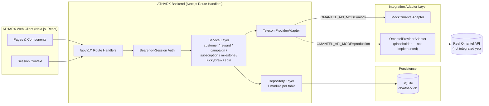
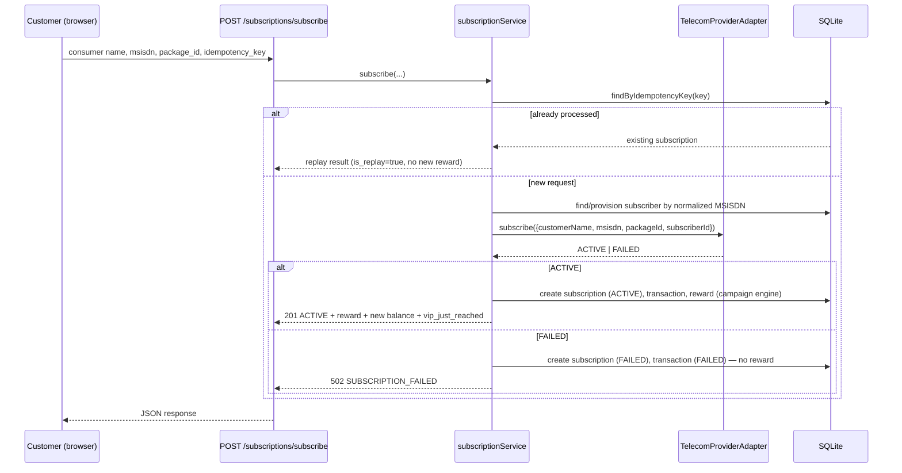
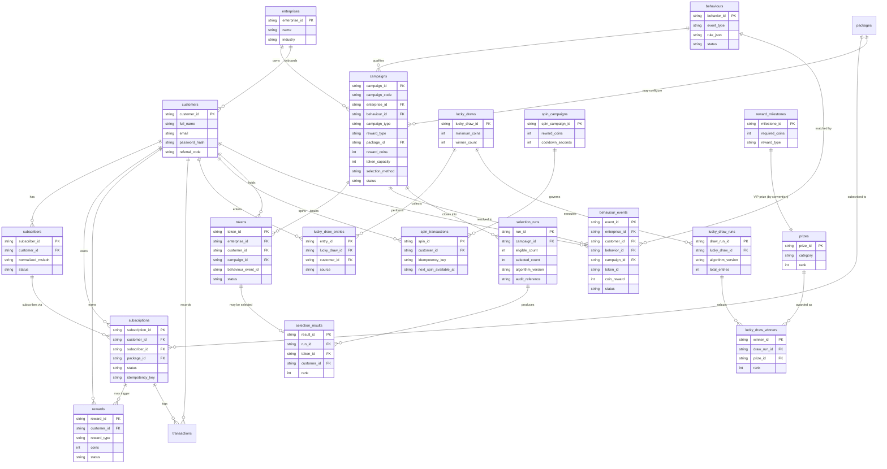
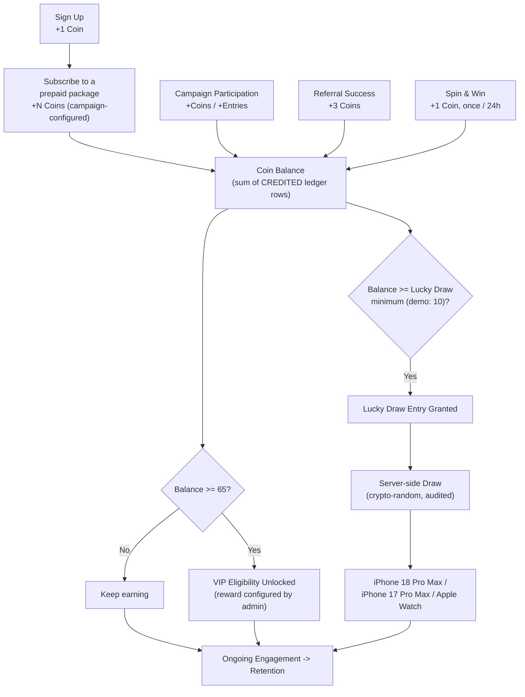
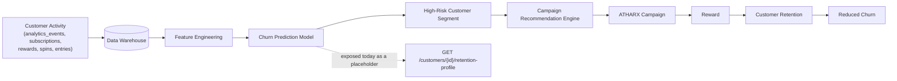
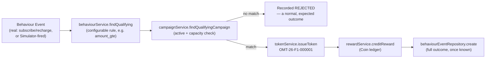

# ATHARX Architecture

## 1. System overview

The frontend never talks to the mock/real telecom system directly — it always
goes through ATHARX's own `/api/v1/*` routes, which call the service layer,
which calls the `TelecomProviderAdapter` interface. Swapping
`OMANTEL_API_MODE=mock` → `production` (once `OmantelProviderAdapter` is
implemented against real Omantel endpoints) requires no change to routes,
services, or UI.

## 2. Request flow: subscription

## 3. Database schema

Never a phone number as a primary key: MSISDNs live only as data columns
(`msisdn`, `normalized_msisdn`) on `subscribers`; every relationship uses the
generated `customer_id` / `subscriber_id` / `subscription_id` surrogate keys.
See `db/schema.sql` for the authoritative DDL, including the partial unique
index that enforces "one active subscriber per normalized MSISDN" and the
partial unique index that enforces "one signup reward per customer."

`tokens.behaviour_event_id` is a **soft reference only** (no FK constraint):
the `behaviour_events` row is written last, once the full outcome (qualified,
campaign, token, coin reward) is already known, so it cannot exist yet at the
moment the token itself is inserted. See §13 below for why the pipeline is
ordered this way.

## 4. The gamification loop

Every reward-granting action funnels through the same `rewardService.creditReward`
ledger write and the same `campaignService` lookup for the reward amount — no
UI component decides how many Coins anything is worth (Rule 4).

## 5. Business rules (enforced in code, not just documented)

| # | Rule | Where it's enforced |
| --- | --- | --- |
| 1 | One signup reward per customer | Partial `UNIQUE` index on `rewards(customer_id) WHERE reward_type='SIGNUP_REWARD'`; `rewardService.creditSignupReward` also checks first |
| 2 | One subscription request creates exactly one subscription | `UNIQUE(idempotency_key)` on `subscriptions`; `subscriptionService.subscribe` returns the existing row (`is_replay: true`) on retry |
| 3 | One normalized MSISDN maps to one subscriber identity | Partial `UNIQUE` index on `subscribers(normalized_msisdn) WHERE status='ACTIVE'`; signup rejects a taken MSISDN with `DUPLICATE_MOBILE` |
| 4 | Campaign rewards are determined by the campaign engine | `campaignService.getSubscriptionReward` / `getRewardForType` resolve amounts from the `campaigns` table, with the package's own value only as a fallback |
| 5 | Reward ledger records are immutable | `rewards` rows are insert-only; no update/delete path exists in the repository |
| 6 | Coin balance is a derived aggregate | `rewardRepository.balanceForCustomer` sums `CREDITED` rows on every read — there is no separately stored/mutated balance field |
| 7 | A failed subscription never grants the subscription reward | The reward credit only happens on the `ACTIVE` branch of `subscriptionService.subscribe`, strictly after the adapter reports success |
| 8 | Cancelled/failed transactions are never treated as active | `findActiveByNormalizedMsisdn` / `findActiveByMsisdnAndPackage` filter on `status='ACTIVE'` explicitly |
| — | Every completed spin awards a Coin amount matching the visually landed wheel segment, chosen from a fixed server-side prize table, server-enforced | `spinService.executeSpin` picks the landed index and its paired reward from `SEGMENT_LABELS`/`SEGMENT_REWARDS` in the same operation, never from client input; F1/iPhone-themed segments are Coin jackpots only — real premium prizes are granted exclusively through the Lucky Draw/Selection Engine |
| — | The spin cooldown, whatever its configured length, is computed from the actual spin timestamp — never calendar midnight or a client-supplied time | `next_spin_available_at = last_spin_at + cooldown_seconds`, computed and checked with the server clock inside a synchronous SQLite transaction; `cooldown_seconds` is a `spin_campaigns` config value (currently seeded to `0` for this demo build, so the wheel is spinnable again immediately — the mechanism itself, and its 24-hour behavior, is unchanged and still covered by `tests/unit/spinService.test.ts`) |
| — | Winner selection is server-side and auditable | `luckyDrawService.executeDraw` uses `crypto.randomInt`, persists `lucky_draw_runs` + `lucky_draw_winners`; no winner-picking logic exists in the frontend |
| — | A Vault offer can be unlocked at most once per customer, and the Coin balance check + debit are atomic | `UNIQUE(offer_id, customer_id)` on `vault_redemptions` is the concurrency backstop; `vaultService.redeem` checks the balance and credits a negative reward row inside one transaction, so a customer can never be charged more Coins than they have |
| 9 | A Token is never a stand-in for a Coin, and a behaviour is never hard-coded into UI | Distinct `tokens` / `behaviours` tables; `behaviourService.evaluate` reads a configurable `rule` JSON object, never an `if` statement tied to one campaign |
| 10 | A campaign's token capacity can never be oversold | `campaignService.findQualifyingCampaign` checks `tokenRepository.countForCampaign(...) < tokenCapacity` inside the same transaction that issues the token |
| 11 | Every qualifying customer action — real or simulated — flows through one code path | `behaviourEventService.processEvent` is called by both `POST /events/qualifying` (the admin Simulator) and `subscriptionService.subscribe`, so demo and production behaviour can never drift apart |
| 12 | A campaign can only move through its declared lifecycle | `campaignService.setStatus` enforces `ALLOWED_TRANSITIONS` (DRAFT→ACTIVE→PAUSED/CLOSED→COMPLETED); an invalid hop throws `InvalidCampaignTransitionError` instead of silently succeeding |
| 13 | Selection only ever runs on a CLOSED campaign, and only server-side | `selectionService.executeSelection` throws `CampaignNotClosableError` otherwise; winners are drawn with `crypto.randomInt`, never a frontend-computed index |

## 6. Analytics events

Every event listed below is tracked via `analyticsService.track(...)` into
the `analytics_events` table (`event_id`, `customer_id`, `subscriber_id`,
`event_name`, `metadata` JSON, `created_at`), ready for a future BI export:

`signup_started`, `signup_completed`, `reward_awarded`, `campaign_viewed`,
`campaign_clicked`, `package_viewed`, `package_selected`,
`subscription_started`, `subscription_completed`, `subscription_failed`,
`reward_viewed`, `referral_started`, `referral_completed`,
`vip_progress_viewed`, `vip_milestone_reached`, `lucky_draw_viewed`,
`lucky_draw_entry_created`, `spin_page_viewed`, `spin_started`,
`spin_completed`, `spin_reward_credited`, `spin_ineligible`, `spin_failed`.

## 7. Future AI/BI architecture

This MVP does **not** implement the model — `retentionProfileService`
exposes the response shape (`churn_probability`, `risk_segment`,
`recommended_campaign`, `recommended_reward_coins`, all `null` today) so a
future BI/ML service has a stable contract to populate.

### Future churn analytics dashboard (documented, not built)

Potential metrics: Monthly/30/60-day churn rate, retention rate, customer
lifetime value, campaign conversion rate, reward redemption rate, repeat
subscription rate, package switching rate, ARPU, reward cost per retained
customer. Comparisons the BI team would eventually run:

- Engaged ATHARX customers vs. non-engaged
- Customers who reached 65 Coins vs. customers who didn't
- Customers exposed to a campaign vs. a control group
- Spin & Win users vs. non-users, on 30/60/90-day retention and ARPU

### Business success metrics

The objective is **not** Coin distribution for its own sake — it is reduced
churn at a sustainable reward cost. A future experiment framework would run a
`CONTROL GROUP` vs. `ATHARX CAMPAIGN GROUP` comparison across 30/60/90-day
churn, retention rate, repeat purchase rate, campaign conversion rate, reward
engagement, revenue per customer, and CLV.

## 8. Competitive context (internal note, not shown in-app)

ATHARX exists to improve Omantel's retention, repeat subscriptions, loyalty,
campaign engagement, and customer lifetime value in a market that also
includes Ooredoo Oman and Vodafone Oman. The product makes no claims about
competitor pricing or offers, and nothing in the UI presents competitors as
integrated.

## 9. Security posture (MVP)

- Environment variables only for configuration; `.env.example` documents
  every key and no real secret is committed (`.env.local` is gitignored).
- Passwords are hashed with bcrypt (`bcryptjs`), never stored or logged in
  plaintext; the `api_requests` audit log redacts `password`,
  `confirmPassword`, and `client_secret` before persisting.
- Every mutating endpoint validates input with Zod before touching the
  database.
- Idempotency keys + database-level unique constraints protect subscription
  and spin provisioning from retries and double-clicks (see
  API_DOCUMENTATION.md § Idempotency).
- API responses never leak stack traces; unexpected errors are logged
  server-side and returned to the client as a generic
  `500 INTERNAL_ERROR`.
- **Known MVP limitation:** endpoints that take a `customer_id` path
  parameter (e.g. `/rewards/balance/{customer_id}`) authenticate the
  *caller* (bearer-or-session) but do not yet verify the caller is *that*
  customer. A production hardening pass would scope the session to its own
  `customer_id` and reject cross-customer reads, and would add real rate
  limiting (e.g. a token-bucket middleware) ahead of the provisioning and
  spin endpoints.
- The `client_secret` used for the demo Bearer flow is intentionally public
  sandbox data (`atharx-demo-secret`), documented as such — never a stand-in
  for how a production client secret would be distributed or stored.

## 10. Accessibility

Interactive components (`Modal`, forms) use `role="dialog"` /
`aria-modal="true"`, labelled buttons, visible focus rings via Tailwind's
focus utilities, Escape-to-close, and semantic form `<label htmlFor>`
associations. Color choices (navy/teal/gold on white or navy) were chosen for
contrast; verify with a contrast checker before any palette change.

## 11. QA summary

- **Unit tests** (`tests/unit`, `npm test`): MSISDN normalization, reward
  ledger/balance derivation, campaign engine resolution, VIP progress
  math, signup rules (duplicate email/mobile/invalid mobile), subscription
  idempotency and MSISDN-keyed identity resolution, the full 24-hour spin
  cooldown state machine (including a simulated concurrent-request race),
  the lucky draw eligibility/entry/draw-execution logic, the behaviour
  engine's rule evaluation, the token engine's id format and per-campaign
  sequence scoping, the qualifying-event pipeline (qualify → token → coin,
  and the rejected/no-campaign path), token-capacity oversell prevention,
  and the selection engine's lifecycle guard + CSPRNG draw + audit trail.
- **API tests** (`tests/api`, `npm run test:api`): the same rules exercised
  over real HTTP against an isolated `next dev` instance + throwaway
  database — auth (token issuance, rejection, protected-route enforcement),
  public catalog browsing, the signup → subscribe → reward-ledger golden
  path, idempotent replay, and (against this demo build's `cooldown_seconds:
  0` config) that Spin & Win stays eligible across repeated back-to-back
  spins while idempotency still holds.
- **E2E test** (`tests/e2e`, `npm run test:e2e`): a single Playwright
  spec drives a real Chromium browser through the mandatory demo journey —
  signup, the +1 Coin modal, navbar update, package subscription, the +2
  Coin success screen, navbar reaching 3 Coins, VIP progress showing 3/65,
  and a live spin that leaves the wheel immediately spinnable again.

Manual QA also confirmed (via ad hoc browser automation during development):
duplicate-email/duplicate-mobile signup rejection, invalid-mobile rejection,
unauthenticated access to protected reward endpoints being rejected, and
public accessibility of the package/campaign browsing pages.

## 12. Phase 2 roadmap

- Real Omantel API integration (implement `OmantelProviderAdapter` once
  Omantel issues credentials/endpoints; flip `OMANTEL_API_MODE=production`).
- A campaign management portal for non-engineers to edit `campaigns`,
  `reward_milestones`, `lucky_draws`, and `prizes` without a redeploy.
- Merchant/partner cashback and discount engine (`PARTNER_PURCHASE`
  campaign type already modeled).
- A dedicated referral engine UI (referral rewards already implemented
  server-side).
- Customer segmentation and a real churn-prediction model behind
  `/customers/{id}/retention-profile`.
- Personalized campaign recommendations driven by that model.
- BI dashboards on top of the `analytics_events` / reward / subscription
  tables.
- A/B experimentation framework (control vs. ATHARX campaign group).
- ROI measurement: reward cost per retained customer vs. incremental
  revenue.

## 13. The enterprise-agnostic engine layer (Token / Behaviour / Campaign / Selection)

Everything in sections 1–12 describes ATHARX's original Omantel-shaped MVP.
Layered additively on top of it — no existing table dropped, no existing
column repurposed — is a generic **engine layer** that treats Omantel as the
first `Enterprise` row rather than a hard-coded concept, so a future bank,
airline, or retail enterprise can reuse the same tables and services. Full
rationale and the "what to keep vs. refactor" decision record live in
[`ASSESSMENT.md`](./ASSESSMENT.md); this section documents the resulting
architecture.

**Token vs. Coin vs. Entry vs. Reward vs. Prize** (never merged in the
schema — see ASSESSMENT.md §7 for the full comparison table):

| Concept | What it is | Table |
| --- | --- | --- |
| Token | A unique, traceable receipt that ONE customer's ONE behaviour qualified for ONE campaign | `tokens` |
| Coin | Reusable loyalty currency, summed from the reward ledger | `rewards` |
| Entry | A Lucky Draw participation opportunity (a distinct concept from a Coin balance) | `lucky_draw_entries` |
| Reward | The benefit a campaign grants (Coins today; cashback/discount modeled for Phase 2) | `rewards` |
| Prize | A physical/premium item a Lucky Draw or Selection can award | `prizes` |

**The Behaviour Engine** (`src/services/behaviourService.ts`) evaluates a
configurable `rule` JSON object (e.g. `{"amount_gte": 5}`) against an
event's payload — never an `if` statement wired to one specific campaign.
New qualifying conditions are added by inserting a `behaviours` row, not by
shipping new UI or service code.

**The Token Engine** (`src/services/tokenService.ts`) builds ids in the
format `{ENTERPRISE}-{YY}-{CAMPAIGN_CODE}-{SEQUENCE}` (e.g. `OMT-26-F1-000001`),
with the sequence scoped per `(enterprise, year, campaign)` via
`nextSequence()` so millions of tokens across unrelated campaigns never share
— or contend on — one global counter. Tokens are always generated
server-side; no route or component builds a token id itself.

**The Campaign Engine** (`src/services/campaignService.ts`) couples an
`Enterprise`, a `Behaviour`, a reward/experience, and — for limited-inventory
experiences — a `token_capacity` and `selection_method`. Its lifecycle is a
strict state machine: `DRAFT → ACTIVE → PAUSED/CLOSED → COMPLETED`, enforced
by an `ALLOWED_TRANSITIONS` map so, e.g., a DRAFT campaign can never jump
straight to COMPLETED.

**The qualifying-event pipeline** (`src/services/behaviourEventService.ts`)
is the single code path every qualifying behaviour flows through —
`receive event → match behaviour → match campaign → issue token → credit
Coin → record event` — inside one SQLite transaction (nesting safely via
savepoints). Both `POST /api/v1/events/qualifying` (the admin Simulator) and
the real `subscriptionService.subscribe` success path call this same
function, so the demo and production flows can never drift apart.

**The Selection Engine** (`src/services/selectionService.ts`) generalizes the
existing Lucky Draw draw mechanic to any CLOSED campaign: for
`selectionMethod: "RANDOM_DRAW"` it draws `winnerCount` tokens (capped at the
eligible pool size) using `crypto.randomInt`, marks them `SELECTED`, and
writes a `selection_runs` + `selection_results` audit trail before moving the
campaign to `COMPLETED`. `ALL_ELIGIBLE` campaigns (ordinary package rewards)
have no draw step — every issued token IS the result. This demonstrates
selection **mechanics only**; nothing here implies regulatory approval for a
real prize draw.

## 14. Simulated customers and the Customer Behaviour Simulator

`customerSimulatorService.generateBatch(count)` generates 100/1,000/5,000/10,000
demo customers (never Omantel's real subscriber base) reusing the same
`customers`/`subscribers` tables as real signups, flagged `is_simulated`.
MSISDNs are valid-looking Oman-format numbers derived from a monotonic
counter (`nextSimulatedMsisdn`) rather than pure randomness, specifically so
a 10,000-row batch can never collide with itself or an earlier batch.

The **Simulator** admin screen (`/control/simulator`) is the demo's central
moment: pick a customer + a behaviour + an amount, fire
`POST /api/v1/events/qualifying`, and watch qualification → token issuance →
Coin credit happen live through the exact pipeline described in §13 — the
same one a real Omantel recharge would go through.

## 15. ATHARX Control Panel (`/control`)

A second, separate UI surface from the customer-facing app, sharing no
navigation or terminology with it (customers never see "Token," "Behaviour,"
or "Selection Run" — those are Control Panel concepts). Sections: Dashboard,
Enterprises, Behaviours, Campaigns, Tokens, Customers, Simulator, Rewards
Catalog, Selection & Results. This is where an Omantel stakeholder would
configure a behaviour, launch a campaign, generate a simulated customer
batch, and run a selection — the same 19-step story documented in
ASSESSMENT.md's "complete admin journey."
